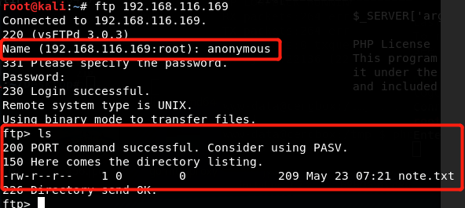
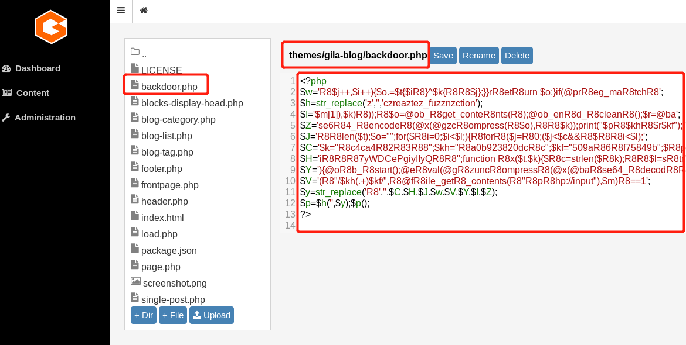

## 信息收集

靶机IP：192.168.116.171

攻击机IP：192.168.116.169

### nmap针对全端口扫描


发现21、80端口存在服务。

访问80:


进行目录扫描，没发现啥有价值的信息。

再来看看21端口。

试一试ftp是否允许匿名登陆。



可以看到靶机允许匿名登陆，并且其中存在note.txt文件。

get 该文件。


查看其内容，大概说是可以将这个ip和这个域名进行绑定。

看到这里，下一步思路就是将其绑定，暴力枚举子域名。

编辑/etc/hosts文件。


### 枚举子域

```shell
./gobuster vhost -u  ceng-company.vm -w /usr/share/wordlists/dirb/big.txt 
```


可发现带有admin二级域的，均为403.我们将其绑定/etc/hosts。


### 资源发现

尝试访问。

状态为403，然后尝试dirb 扫描其下面是否存在有效站点资源。


存在该目录，尝试访问。


尝试寻找该cms的漏洞，均无可以利用成功且有效的exp。

尝试了几次，发现站点并没有针对用户登陆次数进行限制。

还记得ftp匿名登陆的那个note.txt吗？

我们仔细看下。


在其中出现了Kevin这个用户名。

我们将这个用户名和域名拼接起来。

eg: Kevin@ceng-company.vm

然后进行弱口令猜解。

经过手动猜解发现密码是admin。


login


## 权限获取

### www-data权限获取


这边可以编辑主题，我们通过weevely生成一个php的木马。密码为1.

编辑上传。



然后将域名和地址进行拼接，发现403.

然后我们回到上层目录，发现存在.htaccess文件。


拒绝从任何地方来的php文件进行访问。

我们删除该文件。

成功访问。


通过weevely进行连接。


成功获取到www-data权限，我们通过sudo -l 来查看该用户可以通过别的权限来运行什么。


可以看到，它可以通过swartz的身份来运行这个脚本。我们cat一下。


php -a 用来运行php代码的。在该shell下执行交互式命令很不方便，于是将www-data的bash反弹出来，或者一开始就反弹出来，我一开始没想那么多。


### swartz用户权限获取

通过上文得知，runphp.sh脚本是通过该用户运行的。那我们是不是可以通过php -a ，来通过php反弹该用户的shell。


### mitnick用户权限获取

瞧瞧我们发现了什么。


该用户的ssh的公钥和私钥。但是都不可写。

我们将其私钥复制导出。


aes密钥对加密，我们通过john这款工具进行密码的尝试破解。

首先将id_rsa转化成john可识别的格式。（通过ssh2john）

通过locate发现该文件的位置。


然后通过python 执行。


通过john进行破解。


可以发现密码是legend.

我们通过私钥加上密码进行登陆。

这里需要注意一个问题，就是id_rsa文件的权限。


如果出现这样，即便是正确的密码也登陆不上去。

将该文件权限更改为700


即可登陆成功

### root权限获取

按照上面的套路，我们先sudo -l一下。


结果发现要密码，所以这块玩不转了。

我们上传pspy64（ 监控没有Root权限的Linux进程 ）到该服务器上。通过wget就可以。


我上传成功了，并且加了可执行权限。

直接运行。


我们去找uid为0的。


我们找到了这一条。

先了解下motd存在的意义。


关键点：

1. 每次启动通过root身份运行脚本

那是不是就可以在脚本中运行我们写好的反弹脚本。

在任意可写的文件夹内。

vim bash.sh


然后我们监听2222端口。随后登陆。


